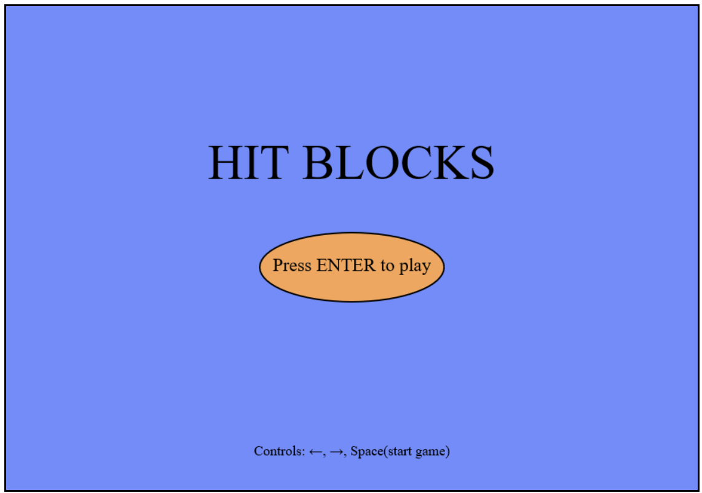
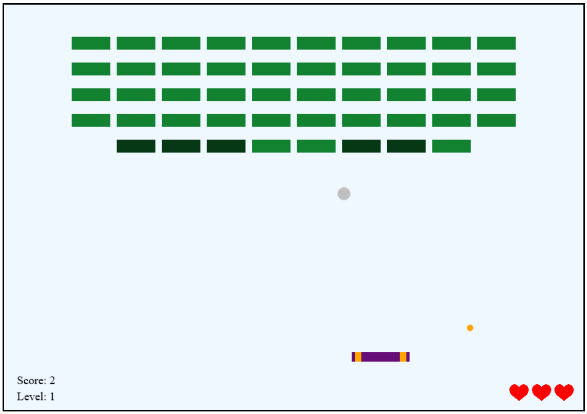

# Hit Blocks

Hit Blocks game. You have 3 attempts to hit all blocks in two levels. Some of the blocks are stronger than others and also there are two types of abilities player can have.

### How to run game
1. Install Node.js
2. Run Node.js command prompt
3. Go to the folder with this game
4. Type and run "http-server"
5. Go on one of the following link that you see in Node.js command prompt

#### Menu Screen

#### Game Screen

